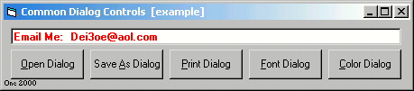



## Using CommonDialog \(Open, Save, Print, Font, Color\)

### Description

learn how to use the Common Dialog Control the right way!!! please vote or at least comment!!
 
### More Info
 

             |
---                |---
**Submitted On**   |2000-06-04 13:39:14
**By**             |[AdamSpicer](https://github.com/Planet-Source-Code/PSCIndex/blob/master/ByAuthor/adamspicer.md)
**Level**          |Beginner
**User Rating**    |4.6 (74 globes from 16 users)
**Compatibility**  |VB 5\.0, VB 6\.0
**Category**       |[Files/ File Controls/ Input/ Output](https://github.com/Planet-Source-Code/PSCIndex/blob/master/ByCategory/files-file-controls-input-output__1-3.md)
**World**          |[Visual Basic](https://github.com/Planet-Source-Code/PSCIndex/blob/master/ByWorld/visual-basic.md)
**Archive File**   |[CODE\_UPLOAD6427642000\.zip](https://github.com/Planet-Source-Code/adamspicer-using-commondialog-open-save-print-font-color__1-8627/archive/master.zip)

